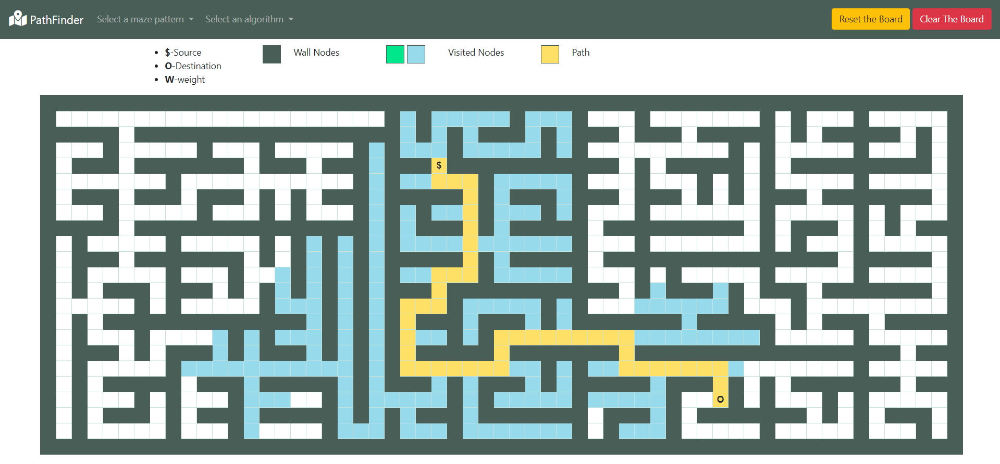
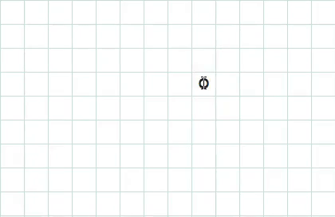
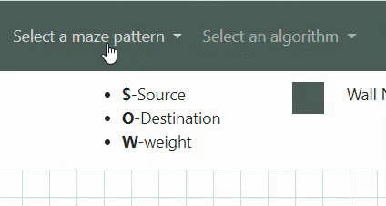

# path-finder
tool for visualizing various path finding algorithms.
https://rohitpjpti18.github.io/path-finder

## Welcome to pathfinder!
Create your own maze and watch as algorithms find a path through them.

## Getting Started ....
Just click and drag on the canvas and it will..
- Make Walls appear or disappear
- Move source and destination to your preference.

- click on select a maze pattern to choose from options to build random mazes or other patterns
- click on select a algorithms to choose from options to find a path between source and destination.

